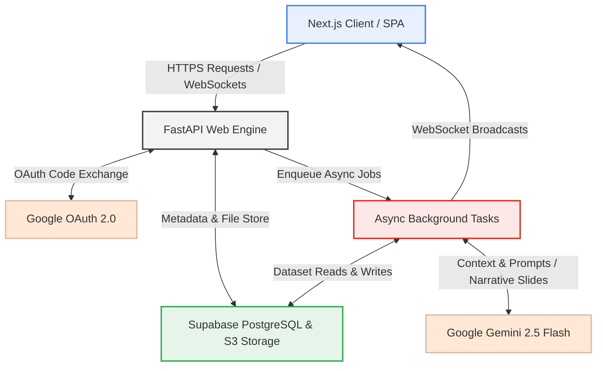
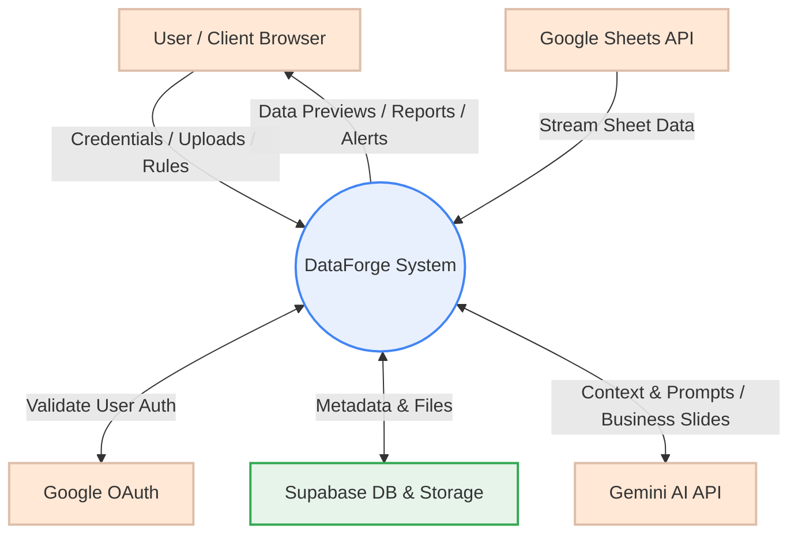
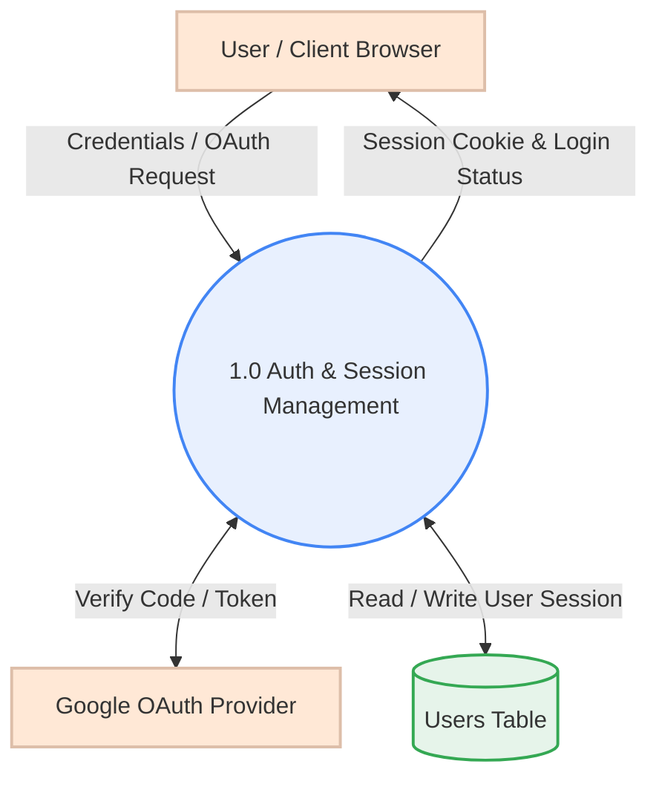
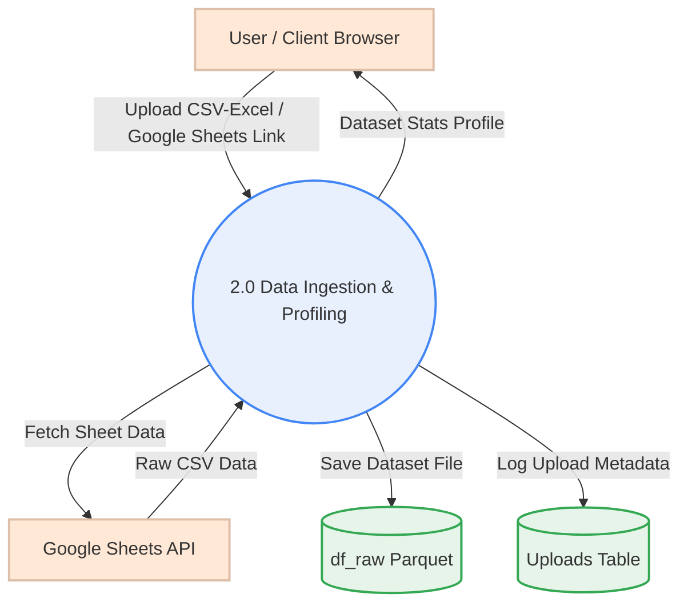
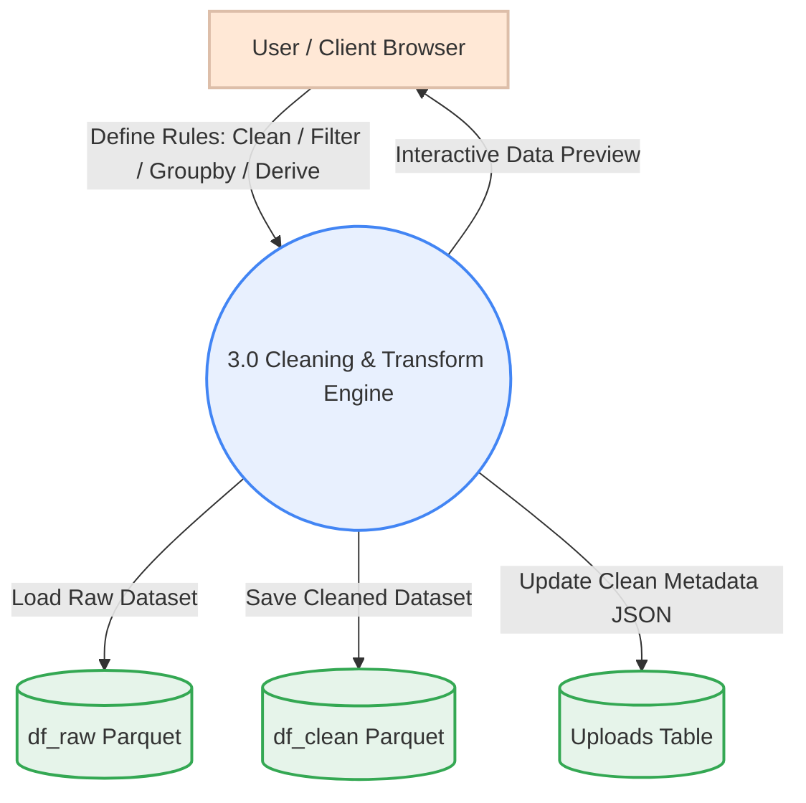
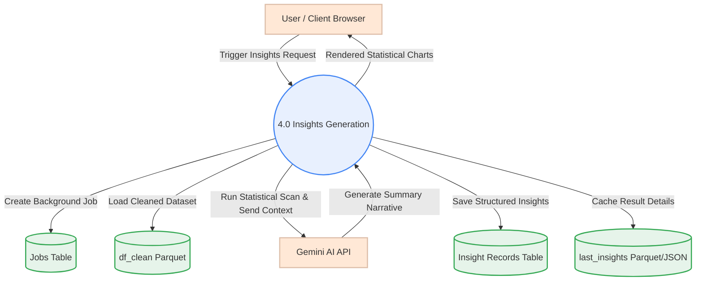
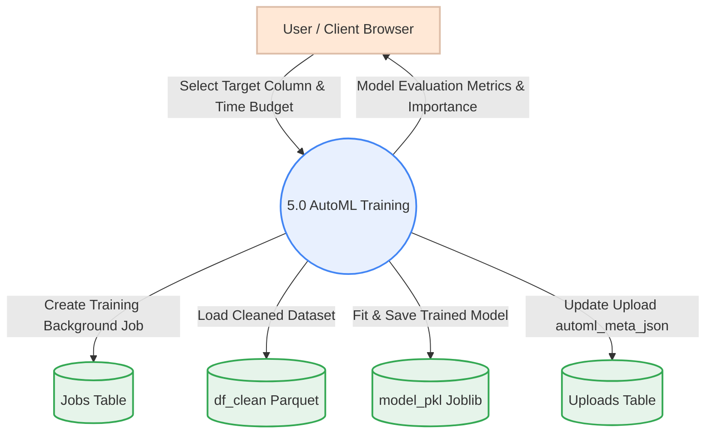
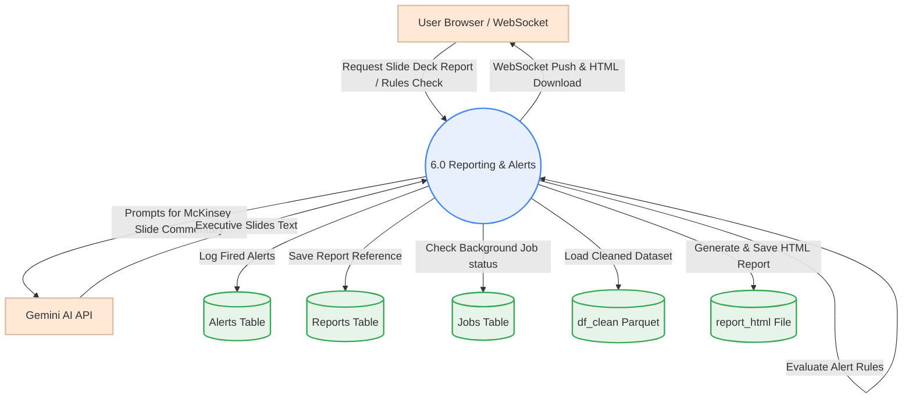

# 🛠️ DataForge v3

DataForge is a premium, enterprise-grade automated data engineering, analytical profiling, and machine learning platform. It empowers organizations to seamlessly ingest raw datasets, execute rule-based data cleaning pipelines, run advanced statistical scans, generate AI-driven narrative business insights, query datasets using conversational natural language, train predictive models automatically, and distribute publication-quality reports.

---

## 🎨 System Architecture Overview

This diagram displays the flow of data and asynchronous requests through the DataForge backend services and third-party integration layers:



---

## 📸 Platform Showcase

Explore the end-to-end user journey within the DataForge ecosystem, showcasing the workflow from secure entry to machine learning deployment.

### 🔐 1. Secure Authentication Portal
A secure, role-based gateway featuring native local credentials verification alongside Google OAuth 2.0 single sign-on (SSO).

<div align="center">
  
  <br/>
  <em>Fig 1: The dual-authentication login modal with seamless OAuth integration.</em>
</div>

### 📥 2. Intelligent Data Ingestion
Drag-and-drop CSV/Excel file uploads or live streaming via public Google Sheets connections, with automatic initial dimension profiling.

<div align="center">
  
  <br/>
  <em>Fig 2: The intuitive drag-and-drop ingestion interface supporting both local files and cloud sheets.</em>
</div>

### 🔍 3. Interactive Data Preview & Profiling
High-fidelity tabular preview of ingested data highlighting missing cell percentages, data type detection, completeness metrics, and summary stats.

<div align="center">
  
  <br/>
  <em>Fig 3: Real-time, high-fidelity data preview with inline column statistics.</em>
</div>

### 🧹 4. Workspace & Data Cleaning Pipeline
Apply rule-based transformations—such as filters, group-bys, column derivations, and missing value interpolations—with visual pipeline state validation and parquet-optimized storage.

<div align="center">
  
  <br/><br/>
  
  <br/>
  <em>Fig 4: Step-by-step visual data cleaning pipeline with instant transformation feedback.</em>
</div>

### 📊 5. Executive Dashboard
An interactive central cockpit showing dataset metrics, key statistics, column distributions, and live WebSocket event activity logs.

<div align="center">
  
  <br/>
  <em>Fig 5: The central command dashboard featuring real-time metrics and live activity feeds.</em>
</div>

### 💡 6. AI-Powered Insight Engine
Automated scans for statistical anomalies, category distributions, trends, and correlations, paired with executive summaries compiled by Google Gemini API.

<div align="center">
  
  <br/>
  <em>Fig 6: The AI Insight Engine revealing hidden correlations, anomalies, and executive narratives.</em>
</div>

### 💬 7. Conversational AI Analyst Chatbot
Interact with datasets in plain English. The sandboxed AI Analyst generates, validates, and runs Python code to create charts and tables on the fly.

<div align="center">
  
  <br/>
  <em>Fig 7: The natural language AI chatbot writing and executing Python data analysis in real-time.</em>
</div>

### 🤖 8. Automated Machine Learning (AutoML)
Automatically detect classification/regression tasks, search for optimal models (XGBoost, LightGBM, Random Forest) via hyperparameter optimization, and export trained model assets.

<div align="center">
  
  <br/>
  <em>Fig 8: Zero-code AutoML model training interface with automatic task detection and tuning.</em>
</div>

### 📑 9. Automated Business Reporting
Generate comprehensive, McKinsey-style presentation decks directly from your data using AI orchestration.

<div align="center">
  
  <br/>
  <em>Fig 9: Generate and download publication-ready reports with one click.</em>
</div>

### 👥 10. The Builders
Meet the talented engineers who built the DataForge ecosystem.

<div align="center">
  
  <br/>
  <em>Fig 10: The DataForge team section.</em>
</div>

---

## 🚀 Core Features

* **Quality & Completeness Scans**: Live quality bars, column-level completeness, and missingness metrics.
* **Rule-Based Data Transformation**: In-place filtering, column renaming, drop/imputation of null values, and custom expressions saved to Parquet.
* **Statistical Insights Engine**: Automatic trend detection, segment analysis, outlier detection, and correlation matrices.
* **AI Summary Generator**: McKinsey-style executive commentary and narrative bullet points powered by `gemini-2.5-flash`.
* **Visual Sandbox Chatbot**: Secure AST validation of generated Python scripts before execution to prevent system calls or arbitrary file edits.
* **AutoML Leaderboard**: Hyperparameter tuning, F1/ROC-AUC scoring, and downloadable pickled model objects.
* **WebSocket Alert Broadcasting**: Instantaneous warnings and live job updates sent to connected browser clients.

---

## 🛠️ Architecture & Technology Stack

| Component | Technology | Description |
| :--- | :--- | :--- |
| **Backend Framework** | FastAPI (Python 3.10+) | High-performance asynchronous API server |
| **Async Tasks** | FastAPI BackgroundTasks | Handles async AutoML training, slides compiling, and alerts |
| **AI Orchestration** | Gemini API (`gemini-2.5-flash`) | Narrative report synthesis and conversational NLP code generation |
| **Database & Storage** | Supabase (PostgreSQL + S3 Bucket) | User credentials storage, workspace state tables, and Parquet data store |
| **Machine Learning** | FLAML (AutoML) + scikit-learn | Fast hyperparameter optimization and model search |
| **Frontend** | Next.js 16, React, Tailwind CSS | Clean, responsive SPA supporting custom themes (dark & light) |

---

## ⚙️ How to Run Locally

### Prerequisites
- **Python 3.10+** — [python.org](https://www.python.org/downloads/)
- **Node.js 18+** — [nodejs.org](https://nodejs.org/)

---

### Step 1 — Clone and Configure Environment

```bash
# Clone the repository
git clone https://github.com/FaheemorFAB/DataForge_v3.git
cd DataForge_v3

# Copy the example env file and fill in your values
cp .env.example .env
```

---

### Step 2 — Backend Setup (FastAPI)

```bash
# Navigate to the backend directory
cd backend

# Create and activate a virtual environment
python -m venv venv

# Activate (Windows PowerShell)
venv\Scripts\Activate.ps1

# Activate (macOS / Linux)
source venv/bin/activate

# Install all dependencies
pip install -r requirements.txt

# Run the FastAPI Server
python main.py
```
The backend server will run on **http://localhost:8000**.

---

### Step 3 — Frontend Setup (Next.js)

In a **second terminal**:

```bash
# Navigate to the frontend directory
cd frontend

# Install dependencies
npm install

# Run the development server
npm run dev
```
The application will be available at **http://localhost:3000**.


## 📐 Data Flow Diagrams (DFDs)

For full architectural transparency, here are the System Data Flow Diagrams:

<details>
<summary>🔍 Level 0: Context Level Diagram</summary>

Shows system boundaries and data exchange between external entities and the core system.


</details>

<details>
<summary>⚙️ Level 1: Feature-Specific DFDs</summary>

### 1. Authentication & Session Management
Manages user logins, credentials validation, and Google OAuth flow.



### 2. Data Ingestion & Import
Handles file uploads (CSV/Excel) and public Google Sheet connections.



### 3. Workspace & Transformation Pipeline
Executes dynamic, rule-based data cleaning, filtering, groupings, and derived column calculations.



### 4. Insights Engine
Runs plugin scanning rules (Trends, Outliers, Correlations, segment analysis) and calls Gemini to build executive summaries.



### 5. AutoML Training
Fits machine learning classifiers or regressors based on target selection, saving and evaluating the results.



### 6. Strategic Reporting & Alerting
Generates presentation-ready HTML/PDF reports using McKinsey-formatted slide commentary, evaluates alert conditions, and broadcasts messages via WebSockets.


</details>
