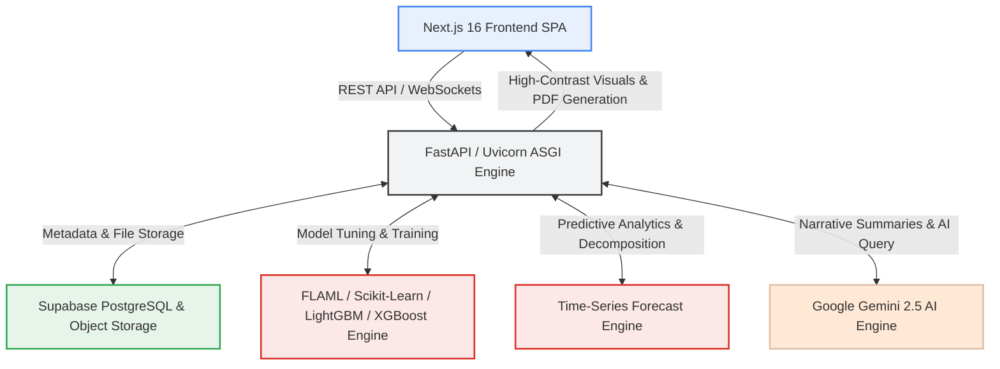

# 🛠️ DataForge v3 — Enterprise AI Data & Analytics Platform

DataForge v3 is a premium, enterprise-grade automated data engineering, analytical profiling, dynamic time-series forecasting, interactive data cleaning, and machine learning platform. Built with a high-performance **FastAPI** backend and a modern **Next.js 16** frontend, DataForge empowers organizations to ingest raw datasets, execute interactive dynamic data cleaning pipelines, run 14+ automated statistical & predictive insight algorithms, build custom dashboard charts with high-contrast visual styling, query data conversationally using AI, train predictive AutoML models, and export McKinsey-grade executive slide decks and vector PDF reports.

---

## 🎨 Architecture & Data Flow



---

## 🌟 Key Platform Capabilities

### 🧹 1. Dynamic Data Cleaning Studio
- **Automated 1-Click Clean**: Normalizes headers to `snake_case` using PyJanitor, prunes columns with >60% missing data, and imputes null values using distribution skewness heuristics.
- **Dynamic Interactive Studio**: Granular per-column cleaning rules:
  - **Imputation**: Mean, Median, Mode, Zero, Custom Constant, Forward Fill (`ffill`), Backward Fill (`bfill`), or Drop Missing Rows.
  - **Outlier Handling**: Winsorization (1st/99th percentile clipping), Replace with Median, or Remove Outlier Rows.
  - **Text Normalization**: Lowercase, Uppercase, Trim Whitespace, Header Normalization.
  - **Type Casting**: Explicit casting to Float, Integer, Datetime, or String.
- **Audit Action Logs**: Real-time before vs. after dataset stats, missing percentage diffs, and downloadable cleaned CSV/Excel files.

### 🔮 2. Advanced Time-Series Predictive Analytics & Auto-Insights Engine
- **Multi-Model Predictive Engine (`ForecastInsight` & `ForecastCard`)**:
  - Automatically detects time-series date/time columns and numeric metrics.
  - Trains and evaluates 6 forecasting algorithms: **ARIMA**, **Prophet**, **Holt-Winters**, **Exponential Smoothing**, **XGBoost**, and an **Ensemble Model**.
  - Provides multi-horizon predictions (7 days, 30 days, 90 days, 1 year).
  - Renders 80% & 95% confidence prediction bands, model MAPE accuracy comparisons, and seasonal/trend/residual decomposition.
- **14 Specialized Insight Plugins**:
  1. `ForecastInsight` — Predictive time-series forecasting & trend projections.
  2. `TrendInsight` — Identifies metric growth and decline patterns over time.
  3. `TopPerformerInsight` — Ranks top and bottom dimensions.
  4. `CorrelationInsight` — Detects metric dependencies and correlations.
  5. `AnomalyInsight` — IQR + Z-score hybrid anomaly detection.
  6. `DistributionInsight` — Skewness, Kurtosis, and histogram distribution profiling.
  7. `ContributionInsight` — Donut chart representation of dimension share.
  8. `SegmentInsight` — Grouped segment performance analysis.
  9. `ChangeInsight` — Period-over-period % change comparison.
  10. `FeatureImportanceInsight` — Key driver impact scores.
  11. `DataQualityInsight` — Column-level completeness meters.
  12. `OutlierSummaryInsight` — Column-by-column IQR outlier counts.
  13. `NumericSummaryInsight` — Coefficient of variation analysis.
  14. `CategoricalInsight` — Category concentration and share.

### 📊 3. Interactive Analytics Dashboard & Custom Chart Builder
- **Custom Chart Builder**: Create custom visualizations (Bar, Line / Time Series, Scatter, Pie, Donut, Box Plot) and pin them to your live dashboard.
- **Case-Insensitive Column Resolution**: Smart `resolve_column` matching tolerant to whitespace and cleaning case transformations.
- **High-Contrast Black Axis Visual Engine**:
  - X and Y axis titles displayed prominently in **bold solid black font** (`#000000`).
  - Axis tick labels, gridlines, and borders formatted in high contrast.
  - Crisp white canvas containers (`#FFFFFF`) ensuring perfect legibility across all dark and light themes.
- **Integrated Forecast Cards**: Surface time-series predictive analytics directly on the Analytics Dashboard.

### 📄 4. McKinsey-Grade Royalty Business Data Reports
- **5-Slide Executive Presentation Deck**:
  - **Slide 1**: Executive Cover with Royalty Seal Crest (`DATAFORGE EXECUTIVE ADVISORY`).
  - **Slide 2**: KPI Footprint & Executive Advisory Assessment.
  - **Slide 3**: Strategic Insights with Embedded Vector SVG Charts.
  - **Slide 4**: Data Health Diagnostics & Column Schema Footprint.
  - **Slide 5**: Actionable Execution Plan & Numbered Priority Cards.
- **Pure Python SVG Vector Chart Engine**: Generates pure SVG line, bar, donut, and scatter graphics that export to PDF with vector crispness.
- **1-Click Vector PDF Saving**: Export high-resolution presentation decks directly to PDF.

### 🤖 5. Automated Machine Learning (AutoML) Studio
- Automatic task detection (Classification vs Regression), hyperparameter tuning via **FLAML**, leaderboard model evaluation (F1 / ROC-AUC / RMSE), **SHAP** feature importance graphs, and downloadable `.pkl` model assets.

### 💬 6. Conversational AI Analyst Chatbot
- Ask natural language questions about your dataset. Features an AST-validated Python code sandbox that safely generates, executes, and renders dynamic pandas dataframes and charts.

---

## 🛠️ Technology Stack

| Layer | Technology | Purpose |
| :--- | :--- | :--- |
| **Frontend** | Next.js 16, React 19, TypeScript, Tailwind CSS 4, DaisyUI 5 | High-performance SPA with modern glassmorphism & responsive themes |
| **Visualization** | Chart.js 4.5+, React-Chartjs-2, Custom SVG Engine | High-contrast black axis charts & vector report graphics |
| **Backend Framework** | FastAPI (Python 3.11+), Uvicorn | High-concurrency async REST API and WebSockets |
| **Time-Series & Math**| Statsmodels, Prophet, XGBoost, SciPy, NumPy, Pandas | Predictive time-series modeling, decomposition & forecasting |
| **Data Engine** | Pandas 2.3+, PyArrow, OpenPyXL, PyJanitor | Fast Parquet storage, DataFrame manipulation & cleaning |
| **Machine Learning** | FLAML, Scikit-Learn, LightGBM, XGBoost, SHAP | Automated model selection, tuning, and explainability |
| **AI Orchestration** | Google Gemini API (`gemini-2.5-flash`) | Executive narrative generation and natural language data querying |
| **Database & Cache** | Supabase (PostgreSQL), Redis | Account data, workspace metadata, and response caching |
| **Report PDF Engine**| Pure Python SVG Engine + WeasyPrint / Print API | Pixel-perfect A4 landscape slide PDF generation |

---

## ⚙️ Quick Start & Local Setup Guide

### Prerequisites
- **Node.js 18+** & `npm` — [nodejs.org](https://nodejs.org/)
- **Python 3.11+** — [python.org](https://www.python.org/)
- **Redis** *(Optional for caching)* — [redis.io](https://redis.io/)

---

### Step 1 — Clone Repository & Environment Setup

```bash
# Clone repository
git clone https://github.com/FaheemorFAB/DataForge_v3.git
cd DataForge_v3-main

# Set up environment variables
cp .env.example .env
```

---

### Step 2 — Backend Setup (FastAPI)

```bash
# Navigate to backend
cd backend

# Create virtual environment
python -m venv venv

# Activate Virtualenv
# Windows (PowerShell):
venv\Scripts\Activate.ps1
# Windows (CMD):
venv\Scripts\activate.bat
# macOS / Linux:
source venv/bin/activate

# Install Python dependencies
pip install -r requirements.txt

# Run FastAPI backend server
python main.py
```
> The backend server will start on **`http://localhost:8000`** (API Docs available at `http://localhost:8000/docs`).

---

### Step 3 — Frontend Setup (Next.js)

In a **second terminal window**:

```bash
# Navigate to frontend
cd frontend

# Install Node dependencies
npm install

# Start Next.js development server
npm run dev
```
> The frontend application will start on **`http://localhost:3000`**.

---

## 📖 User Guide & Step-by-Step Workflow

1. **Upload Dataset**: Navigate to Workspace and drag-and-drop a CSV or Excel file (or connect via Google Sheets link).
2. **Data Cleaning Studio**:
   - Click **1-Click Auto Clean** for instant automated cleaning.
   - Or toggle **Dynamic Studio** to build custom per-column rules (imputation, outlier clipping, text casing, type casting). Click **Apply Dynamic Pipeline**.
3. **Run Insight Engine & Time-Series Forecasting**:
   - Switch to the **Insights** tab and click **Run Insights**.
   - View 14+ auto-detected trends, anomalies, and correlations.
   - Interact with the **Time-Series Predictive Forecast Card** to switch horizons (7d, 30d, 90d, 1yr), inspect 80%/95% confidence bands, model MAPEs, and trend decomposition.
4. **Explore Dashboard & Build Custom Charts**:
   - Switch to **Dashboard** for auto-generated analytical charts, aggregated metrics, and time-series forecast widgets.
   - Click **Add Chart** to open the Chart Builder. Select Chart Type (Bar, Line / Time Series, Scatter, Pie, Donut, Box Plot), X-Axis / Category, Y-Axis / Metric, and Aggregation (Mean, Sum, Count).
   - Click **Add to Dashboard** to pin high-contrast charts with black axis titles and labels to your live dashboard.
5. **Train AutoML Model**: Select your target column in **AutoML**, set your time budget, and train optimal models with SHAP feature importance.
6. **Generate Executive Business Report**:
   - In the **Report** section, click **Generate Analysis**.
   - Preview the 5-slide McKinsey presentation deck with vector SVG charts.
   - Click **Download PDF** for instant 1-click vector PDF saving!

---

## 📄 License & Credits

Built with ❤️ by the DataForge Team. Powered by FastAPI, Next.js 16, Chart.js, PyJanitor, FLAML, Statsmodels, Prophet, and Google Gemini 2.5.
