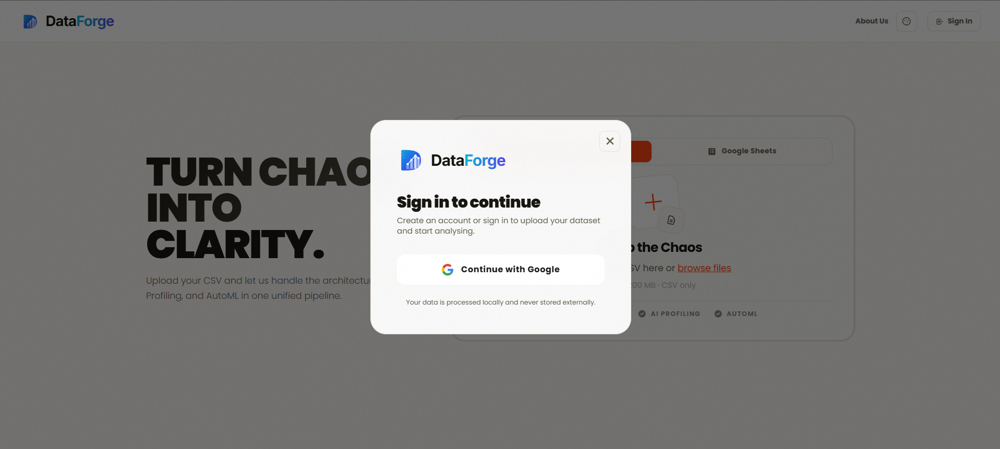
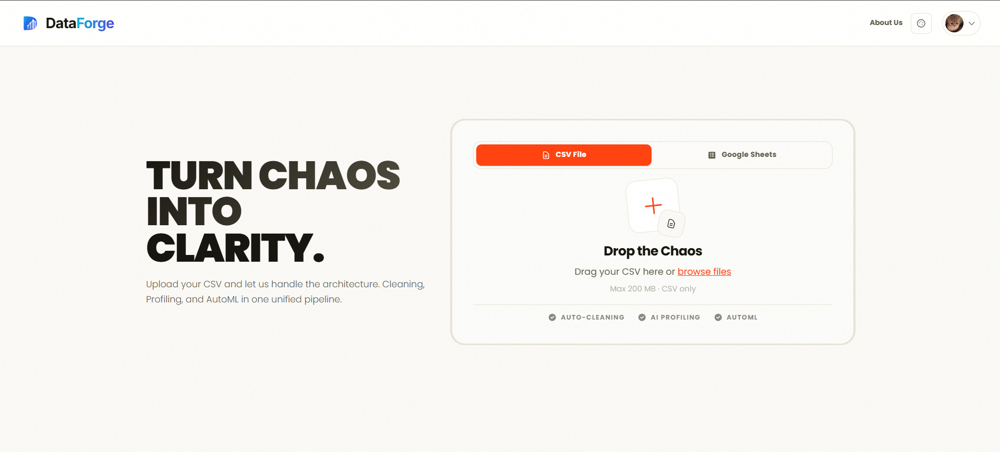
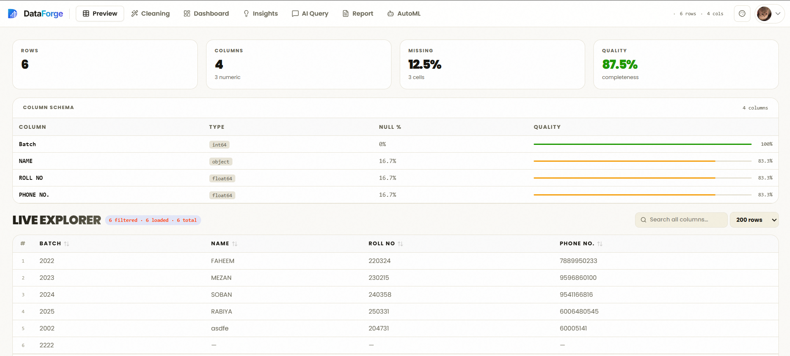
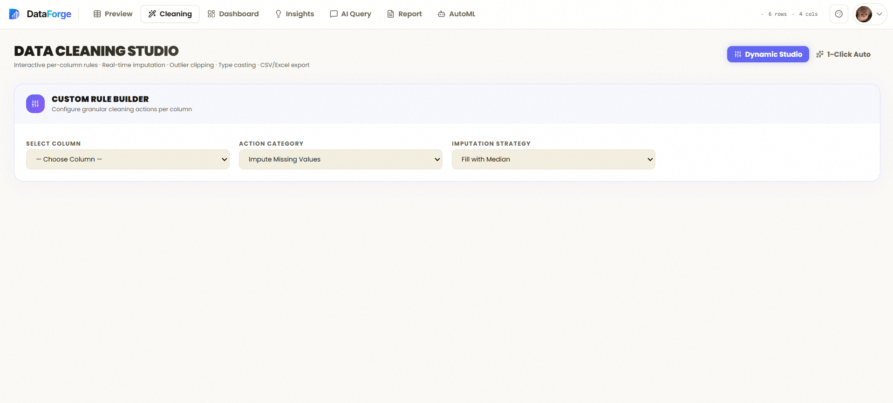
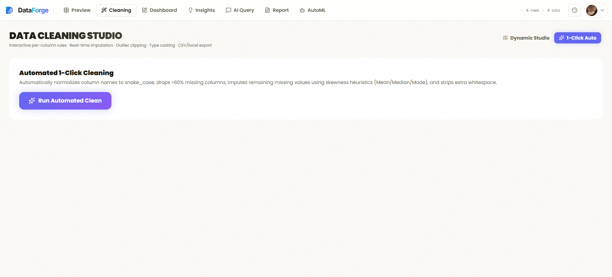
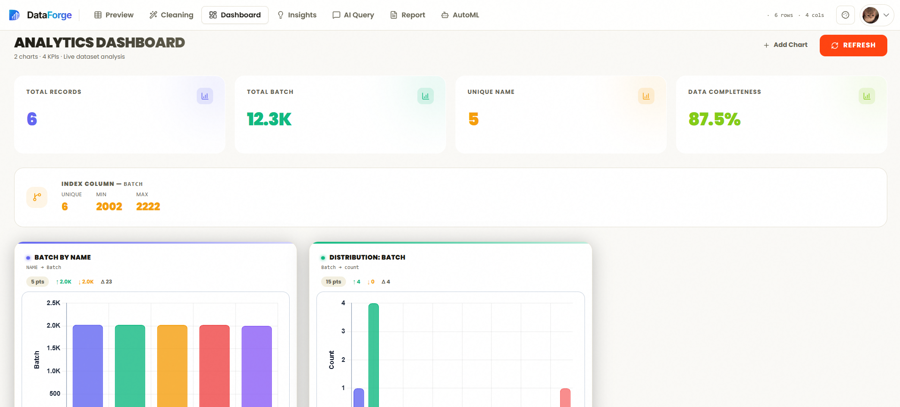
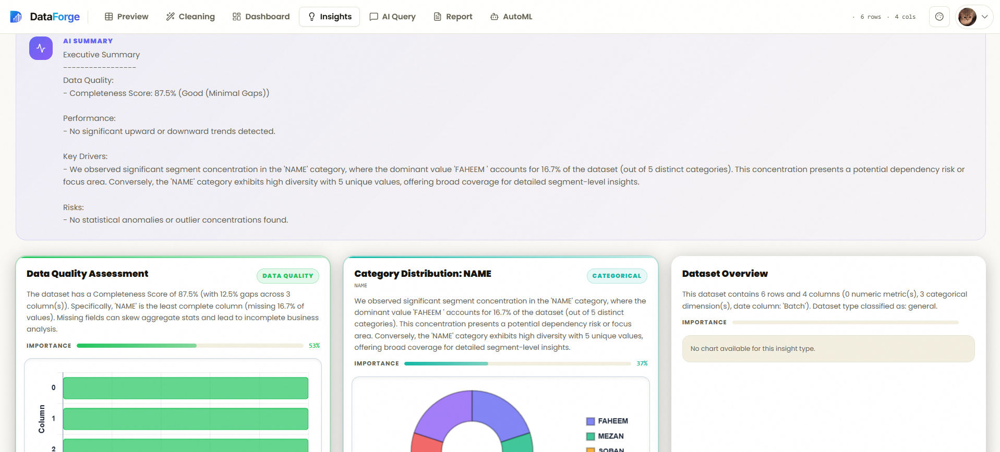
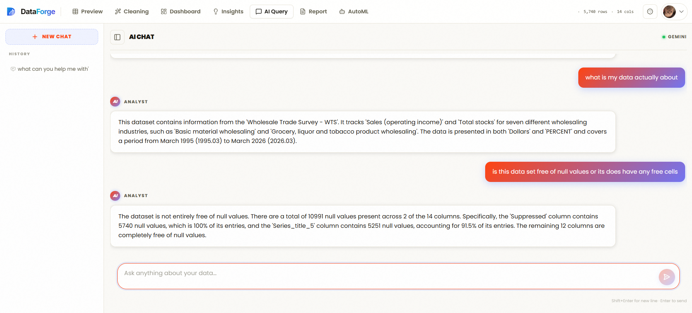
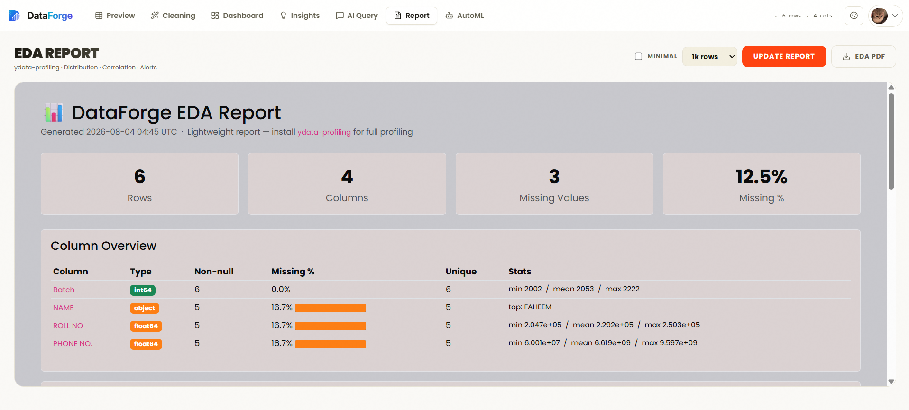
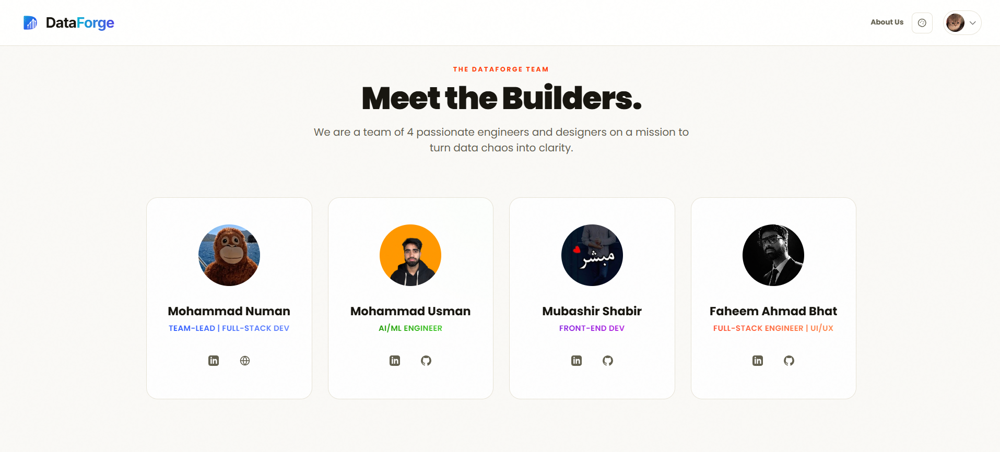

# 🛠️ DataForge v3

DataForge is a premium, enterprise-grade automated data engineering, analytical profiling, and machine learning platform. It empowers organizations to seamlessly ingest raw datasets, execute rule-based data cleaning pipelines, run advanced statistical scans, generate AI-driven narrative business insights, query datasets using conversational natural language, train predictive models automatically, and distribute publication-quality reports.

---

## 📸 Platform Showcase

Explore the end-to-end user journey within the DataForge ecosystem, showcasing the workflow from secure entry to machine learning deployment.

### 🔐 1. Secure Authentication Portal
A secure gateway featuring fast, one-click authentication exclusively powered by Google OAuth 2.0.

  
   
  <em>Fig 1: The secure login modal with seamless Google OAuth integration.</em>

### 📥 2. Data Ingestion
Upload your CSV files or connect directly to Google Sheets for seamless dataset ingestion.

  
   
  <em>Fig 2: The intuitive drag-and-drop ingestion interface supporting both local files and cloud sheets.</em>

### 🔍 3. Data Preview
Tabular grid preview of ingested data highlighting missing cell percentages, basic data types, and summary statistics.

  
   
  <em>Fig 3: Real-time, high-fidelity data preview with inline column statistics.</em>

### 🧹 4. Data Cleaning Pipeline
Apply rule-based transformations such as outlier clipping, missing value imputation, and type casting, saving the results in a parquet-optimized storage format.

  
    
  
   
  <em>Fig 4: Step-by-step visual data cleaning pipeline with instant transformation feedback.</em>

### 📊 5. Interactive Dashboard
A central workspace showing key dataset metrics, interactive charts, and live activity feeds.

  
   
  <em>Fig 5: The central command dashboard featuring real-time metrics and live activity feeds.</em>

### 💡 6. AI Insights
Run automated statistical scans and correlation detection, paired with insightful executive summaries compiled by Google Gemini.

  
   
  <em>Fig 6: The AI Insight Engine revealing hidden correlations, anomalies, and executive narratives.</em>

### 💬 7. AI Data Query
Interact with your data in natural language. The AI securely generates and runs Python Pandas code to answer queries and create dynamic charts.

  
   
  <em>Fig 7: The natural language AI chatbot writing and executing Python data analysis in real-time.</em>

### 🤖 8. AutoML Training
Automatically train classification or regression models on your dataset.

  
   
  <em>Fig 8: Zero-code AutoML model training interface with automatic task detection and tuning.</em>

### 📑 9. Automated Reporting
Generate and export strategic insights into printable presentation decks powered by AI.

  
   
  <em>Fig 9: Generate and download publication-ready reports with one click.</em>

### 👥 10. The Team
Meet the talented engineers who built the DataForge ecosystem.

  
   
  <em>Fig 10: The DataForge team section.</em>

